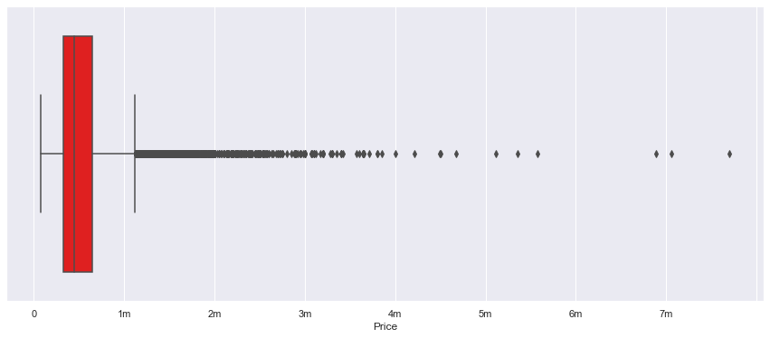

# King County Real Estate
 
Image courtesy of [iStock](https://www.istockphoto.com/photos/king-county-washington-state)

# Overview
We looked at the information on homes sold in King County, WA between May 2014 and May 2015 to create a predictive pricing model.  

## Business Problem
### A real estate company in Seattle, WA is listing homes on their website.
  They want to develop a model that will give a good ball-park estimate of the house's price before listing. 
  Using the information we have from the King County database, what would be an accurate predictor of pricing for these homes?

## Selecting the Target, determining our methods
  * Because the model's goal is to predict price, that will be the target
  * We will use simple linear regression to test multiple linear models

## First we looked at a Heatmap for correlations between Price and all features
 

We noticed the sqft_living feature (Squarefootage of the homes) has the highest correlation to our Target
  
# Exploring Price Data
  Let's first look at the full price data in a Boxplot. 
   
  This is no-good. Let's remove outliers.
   
  A lot of the data falls from about $70,000 to about $1,200,000
