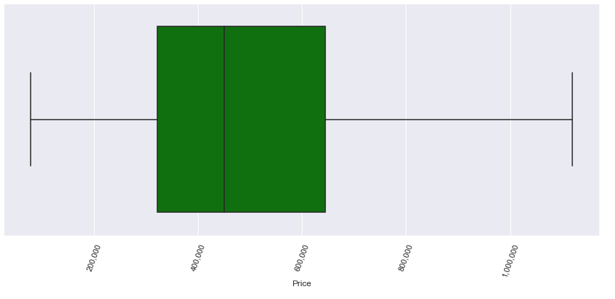

# King County Real Estate
 
Image courtesy of [iStock](https://www.istockphoto.com/photos/king-county-washington-state)

# Overview
We looked at the information on homes sold in King County, WA between May 2014 and May 2015 to create a predictive pricing model.  

## Business Problem
### A real estate company in Seattle, WA is listing homes on their website.
  They want to develop a model that will give a good ball-park estimate of the house's price before listing. 
  Using the information we have from the King County database, what would be an accurate predictor of pricing for these homes?

## Selecting the Target, determining our methods
  * Because the model's goal is to predict price, that will be the target
  * We will use simple linear regression to test multiple linear models

## First we looked at a Heatmap for correlations between Price and all features
 

We noticed the Living Space feature (Squarefootage of the homes) has the highest correlation to our Target, followed by Grade.
  
# Exploring Price Data
  Let's first look at the full price data in a Boxplot. 
   
  This is no-good. Let's remove outliers.
   
  A lot of the data falls from about $70,000 to about $1,200,000, we will stratify our data on this parameter.

# Exploring Living Space data  
  The highest correlated feature was living space. 
  Our first model tested directly tested this onto Price, but it had nearly no effect. 
  
# Exploring Grade variable
  
  Grade is a feature that helped us better stratify the housing prices in our dataset. 
  
  They have a clear upward trend as seen below. 
  
   
  
  We then tested it with the similar train-test-split model from Living Space. 
  
  Unfortunately, it also did not return anything substantial. 

# First Model, Target ~ Two Highest
  We created an OLS model using the top two features. 
  Although the r 2 is still low, it's already a little better. 
  
# Feature Engineering
  ## Grade
  For Grade, we created dummy variables as numeric stand-ins, so we can add Grade to our upcoming model. 
  This will also split Grade into multiple columns for each grade. 
  
  ## Zip Code
  We grouped the zip codes together and used their average price per zip code in place of the zip code itself. This gave us our first useful feature. 
  
# Second Model, train_test_split on first few features. 
  
  We ran our train_test_split on several features, notably Living Space, Waterfront, Zip Code, and Grades. 
  
  It returned an r 2 of about 60.9, which is better, but its validation test was weak. 
  
  We are on the right track. 
  
# Final Model
  First, we stratified price to select houses at $1,200,000 and below, as mentioned earlier. 
  
  We kept some of our previously engineered features such as Zip Code means and the Grade columns. 
  
  We also dropped a lot more columns. The final used columns are: 
    * Living Space 
    * Grade (4-13) 
    * Zip Code mean 
    * Waterfront property 
 
  It returned an 80% effective model with a validation score of 80%. 
  
  Below is a graph of the actual prices transposed on the predicted prices. 
  
  
