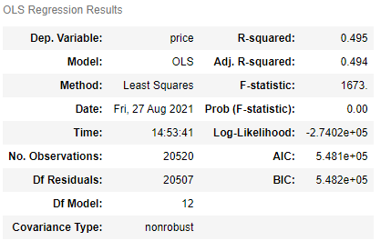

# King County Real Estate
 
Image courtesy of [iStock](https://www.istockphoto.com/photos/king-county-washington-state)

# Overview
We looked at the information on homes sold in King County, WA between May 2014 and May 2015 to create a predictive pricing model.  
  
To see our final notebook, [click here](https://github.com/SethKauf/King_County_Avocoders_Group_3/blob/main/Final%20Notebook.ipynb).

## Business Problem
### A real estate company in Seattle, WA is listing homes on their website.
  They want to develop a model that will give a good ball-park estimate of the house's price before listing. 
  Using the information we have from the King County database, what would be an accurate predictor of pricing for these homes?

## Selecting the Target, determining our methods
  * Because the model's goal is to predict price, that will be the target
  * We will use simple linear regression to test multiple linear models

## First we looked at a Heatmap for correlations between Price and all features
 

We noticed the Living Space feature (squarefootage of the homes) has the highest correlation to our target, followed by the Grade feature. 
  
# Exploring Price Data
  Let's first look at the full price data in a boxplot. 
   
  This is no-good. Let's remove outliers.
   
  A lot of the data falls from about $70,000 to about $1,200,000, we will stratify our data on this parameter.

# Exploring Living Space Data  
  The highest correlated feature was living space. 
  Our first model tested directly tested this onto Price, but it had nearly no effect. 
  
# Exploring Grade Feature
  
  Grade is a feature that helped us better stratify the housing prices in our dataset. 
  
  It has a clear upward trend as seen below. 
  
   
  
  We then tested it with the similar train-test-split model from Living Space. 
  
  Unfortunately, it also did not return anything substantial. 

# First Model, Target ~ Two Highest
  We created an OLS model using the top two features. 
  
  Although the r 2 is still low, it's already a little better. 
  
# Feature Engineering
  ## Grade
  For Grade, we created dummy variables as numeric stand-ins, so we can add Grade to our upcoming model. 
  
  ## Zip Code
  We grouped the zip codes together and used their average price per zip code in place of the zip code itself. 
  
# Second Model, train_test_split on First Few Features. 
  
  We ran our train_test_split on several features, notably Living Space, Waterfront, Zip Code, and Grades as dummy variables. 
  
  It only improved slightly as seen below, but we seemed to be on the right track. 
  
   
  
# Final Model
  First, we stratified price to select houses at below $1,200,000, as mentioned earlier. 
  
  We kept some of our previously engineered features such as Zip Code price means and the Grade columns. 
  
  Here are the features we ended up using in our final model: 
    * Bathrooms 
    * Bedrooms 
    * Grade (4-11, excl. 7) 
    * House Age 
    * Latitude 
    * Living Space 
    * Longitude 
    * Waterfront property   
    * Year Renovated   
    * Zip Code 
    * Zip Code price means 
    
 
  It returned an 80% effective model with a validation score of 80%. 
  
  Below is a graph of the actual prices transposed on the predicted prices. 
  
   

  Below is also a screengrab of the final model scores in OLS (non-scaled). The full model breakdown is in the final notebook. 
  
   
  
  # Regression Tests
  
  Finally, our tests for Linearity, Normality, and Homoscedasticity 
  
   
   
   
  
  Our tests show our model, although still somewhat affected by outliers, is mostly good for a linear regression model.
  
  # Next Steps
  
  We recommend that future iterations of the model look into other features from the original dataset, such as Latitude and Longitude, or the Year Renovated and Year Built, unscaled. 
  
  We also recommend adding other features, such as number of houses on the market in the area, the "Walking score", proximity to school(s), etc.
